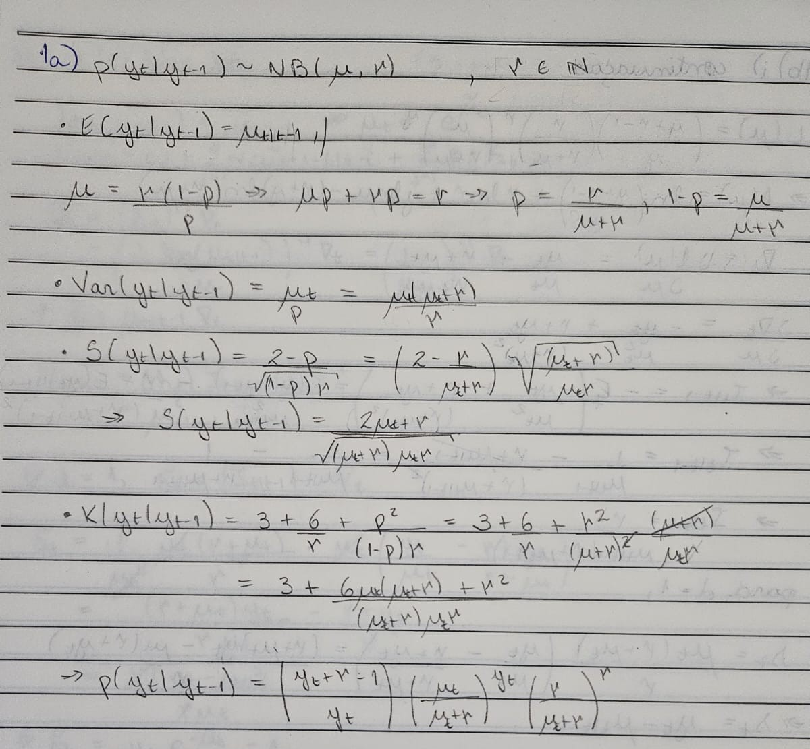

# Questão 1

$$
\begin{aligned}
p(y_t|y_{t-1}) \sim NB(\mu, r) \\
\end{aligned}
$$

## Item a) Parametrização e momentos da distribuição

## Item b) Equação da média com GAS(p,q)
### i) Link identidade

### ii) Link log

## Item c) Equação da média com CNO 
$$
\begin{aligned}
p(y_t|y_{t-1}) \sim NB(\mu, r) \\
E[y_t|y_{t-1}] = \mu_{t|t-1} \\
h(\mu_{t+1|t}) = \tilde\mu_{t+1|t} \\
\tilde\mu_{t+1|t} = m_{t+1|t} + \gamma_{t+1|t}
\end{aligned}
$$

### i) Sazonalidade por dummy Harrison & Stevens [TODO]

### ii) Sazonalidade por trigonométricos
A tendência $m_{t+1|t}$ segue um AR(1) com drift, enquanto a sazonalidade é dada pela soma de funções trigonométricas: $\gamma_{t+1|t} = \sum_{j=1}^{6}\gamma_{j,t+1|t} $. É possível escrever as equações dessas componentes não observáveis na forma matricial abaixo.

$$
\begin{aligned}

\begin{cases}

\tilde\mu_{t+1|t} = 
\begin{pmatrix}
1 & 1 & 0 & 1 & 0 & 1 & 0 & 1 & 0 & 1 & 0 & 1
\end{pmatrix}
\cdot 
\begin{pmatrix}
m_{t+1|t} \\ \gamma_{1,t+1|t} \\ \gamma^*_{1,t+1|t} \\ \gamma_{2,t+1|t} \\ \gamma^*_{2,t+1|t} \\ \gamma_{3,t+1|t} \\ \gamma^*_{3,t+1|t} \\ \gamma_{4,t+1|t} \\ \gamma^*_{4,t+1|t} \\ \gamma_{5,t+1|t} \\ \gamma^*_{5,t+1|t} \\ \gamma_{6,t+1|t}
\end{pmatrix} \\

\begin{pmatrix}
m_{t+1|t} \\ \gamma_{1,t+1|t} \\ \gamma^*_{1,t+1|t} \\ \gamma_{2,t+1|t} \\ \gamma^*_{2,t+1|t} \\ \gamma_{3,t+1|t} \\ \gamma^*_{3,t+1|t} \\ \gamma_{4,t+1|t} \\ \gamma^*_{4,t+1|t} \\ \gamma_{5,t+1|t} \\ \gamma^*_{5,t+1|t} \\ \gamma_{6,t+1|t}
\end{pmatrix} = 
\begin{pmatrix}
\omega \\0 \\0 \\0 \\0 \\0 \\0 \\0 \\0\\0 \\0 \\0
\end{pmatrix} +
\begin{pmatrix}
\alpha & 0 & 0 & 0 & 0 & 0 & 0 & 0 & 0 & 0 & 0 & 0 \\ 
0 & cos(\lambda_1) & sin(\lambda_1) & 0 & 0 & 0 & 0 & 0 & 0 & 0 & 0 & 0 \\ 
0 & -sin(\lambda_1) & cos(\lambda_1) & 0 & 0 & 0 & 0 & 0 & 0 & 0 & 0 & 0 \\ 
0 & 0 & 0 & cos(\lambda_2) & sin(\lambda_2) & 0 & 0 & 0 & 0 & 0 & 0 & 0 \\ 
0 & 0 & 0 & -sin(\lambda_2) & cos(\lambda_2) & 0 & 0 & 0 & 0 & 0 & 0 & 0 \\ 
0 & 0 & 0 & 0 & 0 & cos(\lambda_3) & sin(\lambda_3) & 0 & 0 & 0 & 0 & 0 \\ 
0 & 0 & 0 & 0 & 0 & -sin(\lambda_3) & cos(\lambda_3) & 0 & 0 & 0 & 0 & 0 \\ 
0 & 0 & 0 & 0 & 0 & 0 & 0 & cos(\lambda_4) & sin(\lambda_4) & 0 & 0 & 0 \\ 
0 & 0 & 0 & 0 & 0 & 0 & 0 & -sin(\lambda_4) & cos(\lambda_4) & 0 & 0 & 0 \\ 
0 & 0 & 0 & 0 & 0 & 0 & 0 & 0 & 0 & cos(\lambda_5) & sin(\lambda_5) & 0 \\ 
0 & 0 & 0 & 0 & 0 & 0 & 0 & 0 & 0 & -sin(\lambda_5) & cos(\lambda_5) & 0 \\ 
0 & 0 & 0 & 0 & 0 & 0 & 0 & 0 & 0 & 0 & 0 & -1 \\ 
\end{pmatrix}  \cdot
\begin{pmatrix}
m_{t|t-1} \\ \gamma_{1,t|t-1} \\ \gamma^*_{1,t|t-1} \\ \gamma_{2,t|t-1} \\ \gamma^*_{2,t|t-1} \\ \gamma_{3,t|t-1} \\ \gamma^*_{3,t|t-1} \\ \gamma_{4,t|t-1} \\ \gamma^*_{4,t|t-1} \\ \gamma_{5,t|t-1} \\ \gamma^*_{5,t|t-1} \\ \gamma_{6,t|t-1}
\end{pmatrix} +
\begin{pmatrix}
\kappa^m \\ \kappa^\gamma \\ \kappa^\gamma \\ \kappa^\gamma \\ \kappa^\gamma \\ \kappa^\gamma \\ \kappa^\gamma \\ \kappa^\gamma \\ \kappa^\gamma\\ \kappa^\gamma \\ \kappa^\gamma \\ \kappa^\gamma
\end{pmatrix} \tilde s_{t},

\end{cases}
\end{aligned}
$$

$$
\begin{aligned}
\tilde s_{t} = y_te^{-\tilde \mu_{t|t-1}}-1 \\
\Rightarrow \tilde s_{t} = y_te^{-m_{t|t-1} + \gamma_{t|t-1}}-1
\end{aligned}
$$

## Item d) Log da verossimilhança [TODO]

# Questão 2 [todo]

# Questão 3
$$
\begin{aligned}
y_{t} &= \mu_t + \epsilon_t,  \quad \epsilon_t \sim N(0, \sigma^2) \\
\end{aligned}
$$

# Questão 4

## Item a) Parametrização e momentos da distribuição

## Item b) Equação dos parâmetros
### i) GAS [INCOMPLETE]
### ii) CNO [TODO]

## Item c) Log da verossimilhança [TODO]

## Item d) Estimação do modelo [TODO]