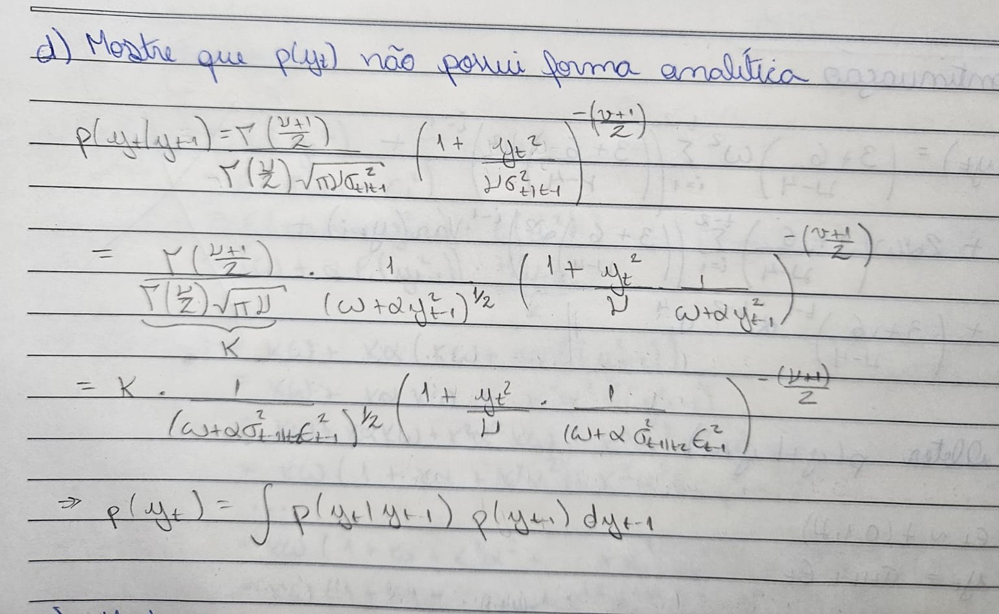
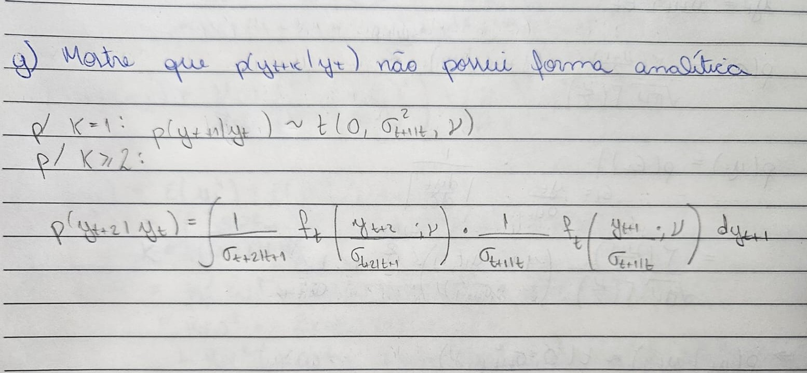
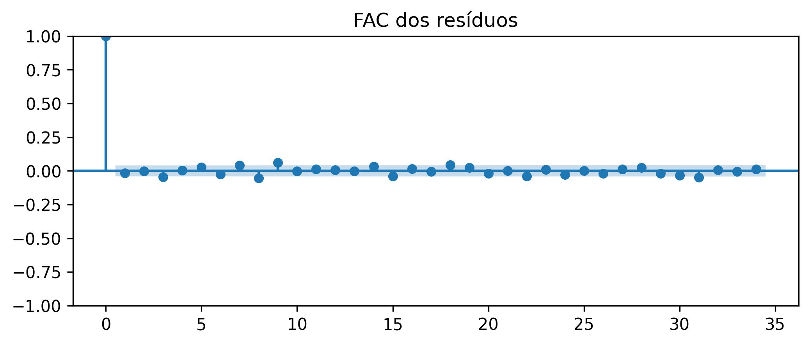

# Questão 1


$$
\begin{aligned}
y_{t|t-1} &= \sigma_{t|t-1} \cdot \epsilon_t \quad \epsilon_t \sim t(0, 1, \nu) \\
\sigma^2_{t+1|t} &= \omega + \alpha y_t^2
\end{aligned}
$$


## Item a) Momentos condicionais
A distribuição condicional é simétrica e possui valor esperado e coeficiente de simetria condicionais iguais a zero. Já a variância condicional é dada pela variância do modelo ARCH e do erro, que segue uma distribuição t-student. O coeficiente de curtose é maior que 3, indicando que a distribuição é leptocúrtica.


   

## Item b) Distribuição condicional
A distribuição condicional é uma t generalizada com $\nu$ graus de liberdade e escala dada pela variância do modelo. A densidade possui a mesma forma da distribuição do erro, que é uma t com escala igual a 1.


## Item c) Momentos incondicionais
Assim como o valor esperado e coeficiente de simetria condicionais, o valor esperado e o coeficiente de simetria incondicionais são iguais a zero.
A variância e o coeficiente de curtose são obtidos por recursividade a partir das equações do modelo e convergem para um valor constante quando t tende a infinito e o modelo é estacionário, ou seja, $\alpha < \frac{\nu}{\nu-2}$.


## Item d) Distribuição incondicional
Para obter a densidade incondicional $p(y_t)$, é necessário integrar a densidade de probabilidade condicional $p(y_t|y_{t-1})$ sobre a variável $y_{t-1}$. Ao substituir recursivamente as equações do modelo na função de densidade condicional, é possível observar que a função na integral adquire uma forma complexa, que não é possível resolver analiticamente.



## Item e) Correlações

A correlação linear é nula, pois não há dependência linear de $y_t$ com seus lags no modelo. Já a correlação quadrática é positiva e decai com o tempo, proporcional a $\alpha^k$. Esse resultado é explicado pela presença de dependência quadrática no modelo e é determinado pela persistência da volatilidade na equação (2).

### i) Linear


### ii) Quadrática


## Item f) Momentos da densidade preditiva


## Item g) Densidade preditiva
Para k=1, a função de densidade preditiva possui uma forma bem definida e segue uma distribuição t. 

Já para k=2, é possivel obter a densidade preditiva por marginalização. Ao desenvolver o cálculo da expressão na integral, é obtida uma equação em que as densidades t são funções da escala $\sigma_{t+2|t+1}$, que por sua vez depende da variável de integração $y_{t+1}$. Dessa forma, não é possível resolver a integral para obter uma forma analítica da densidade preditiva.



## Item h) Simulação
Usando os parâmetros arbitrariamente escolhidos para satisfazer a existência de todos os momentos calculados e a condição de estacionariedade, os coeficientes de simetria amostrais obtidos foram -0.47 e 0.02 para k=3 e k=30, respectivamente. Esses valores são próximos ao valor teórico calculado e indicam que a distribuição é simétrica.

Para k=3, o coeficiente de curtose obtido em t=200 foi K=21. A grande diferença do resultado obtido para o valor teórico do coeficiente de curtose do erro indica que nesse horizonte o processo possui caudas mais pesadas que uma distribuição t. Já para k=30, o coeficiente de curtose calculado foi 8.3, mais próximo da curtose de uma t(5). Esse resultado indica que em horizontes maiores a ocorrência de valores extremos é suavizada, e a distribuição tende à densidade incondicional. 


```bash
import numpy as np
import matplotlib.pyplot as plt
from matplotlib.ticker import PercentFormatter
import scipy.stats as stats
import seaborn as sns
from statsmodels.graphics.tsaplots import plot_acf, plot_pacf
import yfinance as yf
from arch import arch_model
import pandas as pd

rng = np.random.default_rng(seed=4)

# simulação da série do modelo
nu = 5
omega, alpha = 1, 0.2
T = 200
y1 = 5

epsilont = rng.standard_t(df=nu, size=T)
yt = np.zeros(T)
yt[0] = y1

for i in range(1, T):
    sigma2 = omega + alpha * yt[i-1]**2
    yt[i] = sigma2**0.5 * epsilont[i]

series = yt.copy()

# simulação da densidade preditiva
k = 3
N = 10000

y_hat = np.zeros((T+k,N))

for t in range(T):
    y_curr = np.full(N, series[t])
    epsilont = rng.standard_t(df=nu, size=(k,N))
    
    for i in range(k):
        sigma2_hat = omega + alpha * y_curr**2
        y_curr = sigma2_hat**0.5 * epsilont[i]

    y_hat[t+k] = y_curr

# histograma
print(f'Skewness: {stats.skew(y_hat[T-1+k]):.2f}')
print(f'Kurtosis: {stats.kurtosis(y_hat[T-1+k]) + 3:.2f}')

fig, ax = plt.subplots(figsize=(10,4))
ax.hist(y_hat[T-1+k], bins=20)
ax.set_title('Histograma da densidade preditiva para t=200 e k=3')
plt.show()
```

## Item i) Log verossimilhança


## Item j) Retornos diários
Foi ajustado um modelo ARCH(1) com erro $\epsilon_t \sim t(0,1,\nu)$ à serie de retornos diários das ações da Apple. Foram usados dados desde Jun/2016 e variações percentuais do valor da ação.

A FAC dos resíduos padronizados não possui valores significativos de autocorrelação nos lags, indicando que não há depencia linear e que o modelo capturou bem essa dinâmica da série. Já a FAC dos resíduos ao quadrado possui valores significativos e indica a existência de heterocedasticidade. 

Esse resultado sugere que ainda há dependência de segunda ordem na volatilidade que não foi capturada pelo modelo, o que pode ser esperado de um modelo simples ARCH(1). Esse modelo pode ser melhorado incluindo lags da variância e estimando um ARCH(p,q).




```bash
import numpy as np
import matplotlib.pyplot as plt
from matplotlib.ticker import PercentFormatter
import scipy.stats as stats
import seaborn as sns
from statsmodels.graphics.tsaplots import plot_acf, plot_pacf
import yfinance as yf
from arch import arch_model
import pandas as pd

# importação de dados
series = pd.read_csv('C:\\Users\\aless\\Downloads\\Apple Stock Price History.csv')[['Date','Price']].set_index('Date')
series.index = pd.to_datetime(series.index)

returns = series.pct_change().mul(100).dropna().loc['2016-06':]

# estimação do modelo
model = arch_model(returns, vol='GARCH', p=1, q=0, dist='t', mean='Constant')
res = model.fit(disp='off')
print(res.summary())

std_resid = res.std_resid.dropna()

# figuras
fig, ax = plt.subplots(figsize=(8,3))
ax.plot(returns)
ax.set_title('Variação percentual diária dos preços da ação AAPL')
ax.set_ylabel('(p.p.)')
plt.savefig('C:\\Users\\aless\\Desktop\\Codes\\masters\\SDM\\img\\retornos.jpg', dpi=300, bbox_inches='tight')
plt.show()

fig, ax = plt.subplots(figsize=(8,3))
ax.plot(std_resid)
ax.set_title('Resíduos padronizados')
plt.savefig('C:\\Users\\aless\\Desktop\\Codes\\masters\\SDM\\img\\resíduos.jpg', dpi=300, bbox_inches='tight')
plt.show()

fig, ax = plt.subplots(figsize=(8,3))
plot_acf(std_resid**2, ax=ax, title='FAC dos resíduos ao quadrado')
plt.savefig('C:\\Users\\aless\\Desktop\\Codes\\masters\\SDM\\img\\FAC.jpg', dpi=300, bbox_inches='tight')
plt.show()

```

# Questão 2
## item a) $  y_t = g_{t|t-1} + \epsilon_t $ 
### i) $ \epsilon_t \sim  Gamma(\mu,\theta) $
A densidade preditiva tem a mesma forma do erro $\epsilon_t$ e segue uma distribuição Gamma generalizada, deslocada em $g_{t|t-1}$.


### ii) $ \epsilon_t \sim  Poisson(\lambda) $
A densidade preditiva tem a forma da distribuição de Poisson do erro $\epsilon_t$, deslocada em $g_{t|t-1}$.


### iii) $ \epsilon_t \sim  Beta(\alpha, \beta) $
A densidade preditiva segue a mesma distribuição Beta do erro, definida em $g_{t|t-1} < y_t < g_{t|t-1} + a $.


## item b) $  y_t = g_{t|t-1} \cdot \epsilon_t $ 
### i) $ \epsilon_t \sim  Exp(\lambda) $
A densidade preditiva segue uma distribuição exponencial com $\lambda = \lambda_\epsilon/g_{t|t-1}$.


### ii) $ \epsilon_t \sim  Gamma(\mu, \theta) $
A densidade preditiva não pertence à mesma família da distribuição de $\epsilon_t$.


### iii) $ \epsilon_t \sim  Poisson(\lambda) $
A densidade preditiva não pertence à mesma família da distribuição de $\epsilon_t$.
