# Questão 1


$$
\begin{align*}
y_{t|t-1} &= \sigma_{t|t-1} \cdot \epsilon_t \quad \epsilon_t \sim t(0, 1, \nu) \\
\sigma^2_{t+1|t} &= \omega + \alpha y_t^2
\end{align*}
$$


## Item a) Momentos condicionais
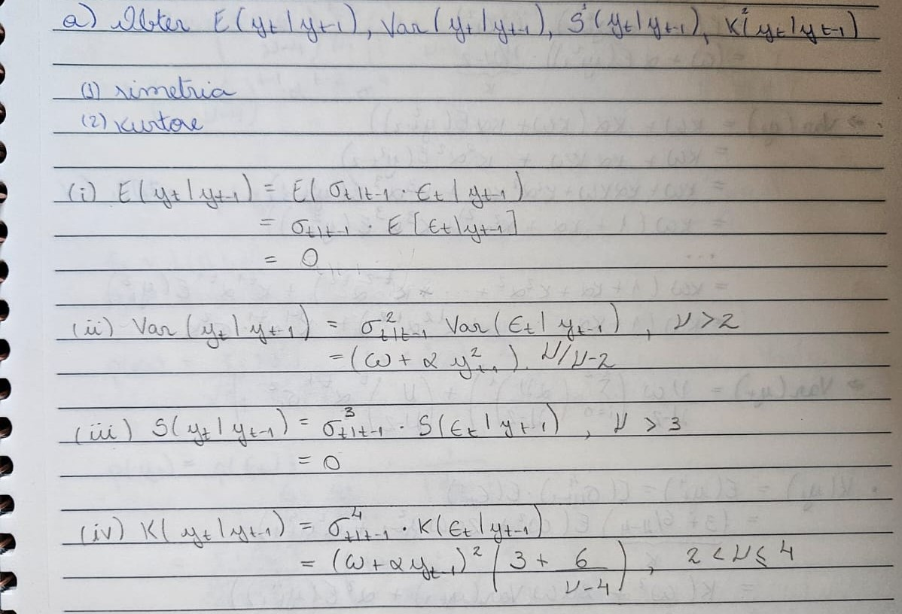
   

## Item b) Distribuição condicional

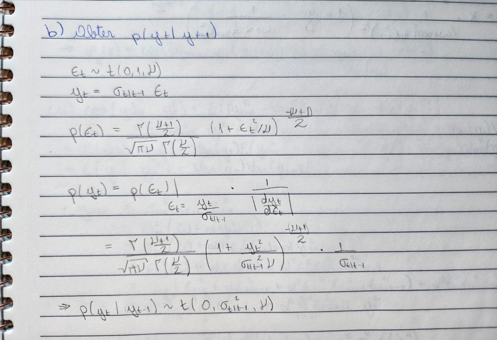


## Item c) Momentos incondicionais

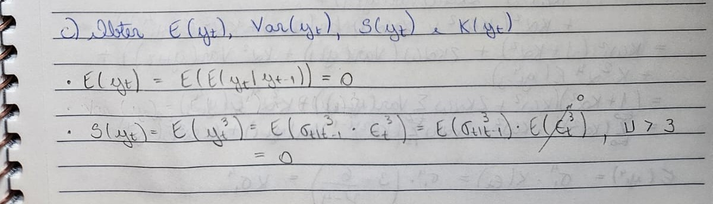
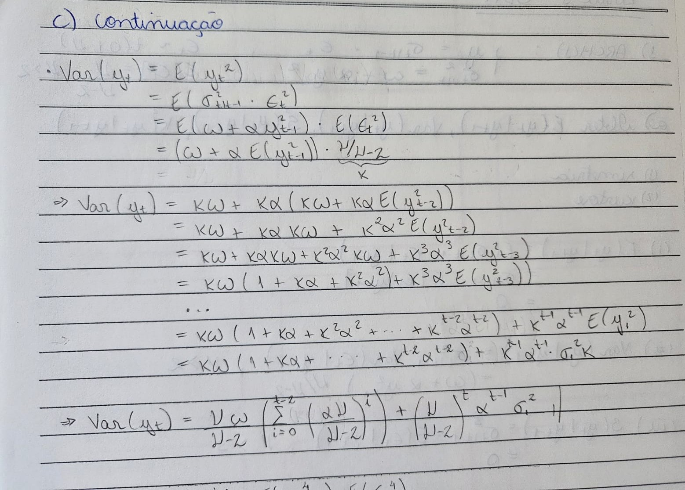
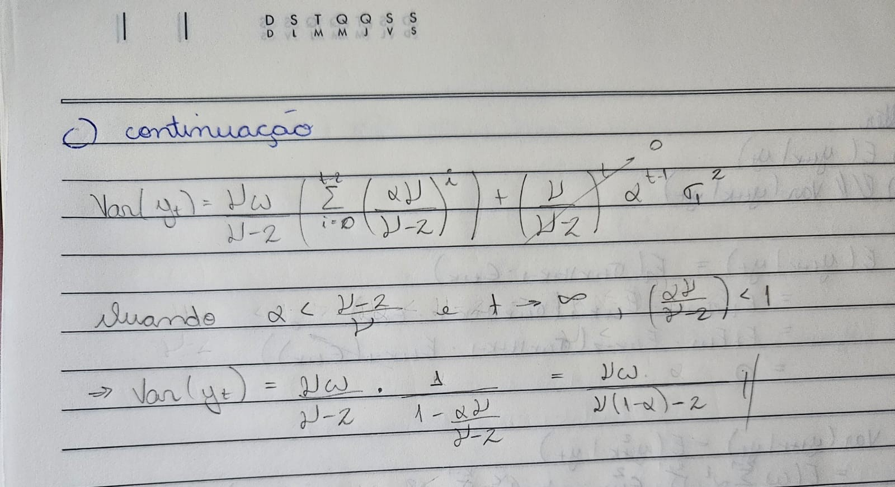
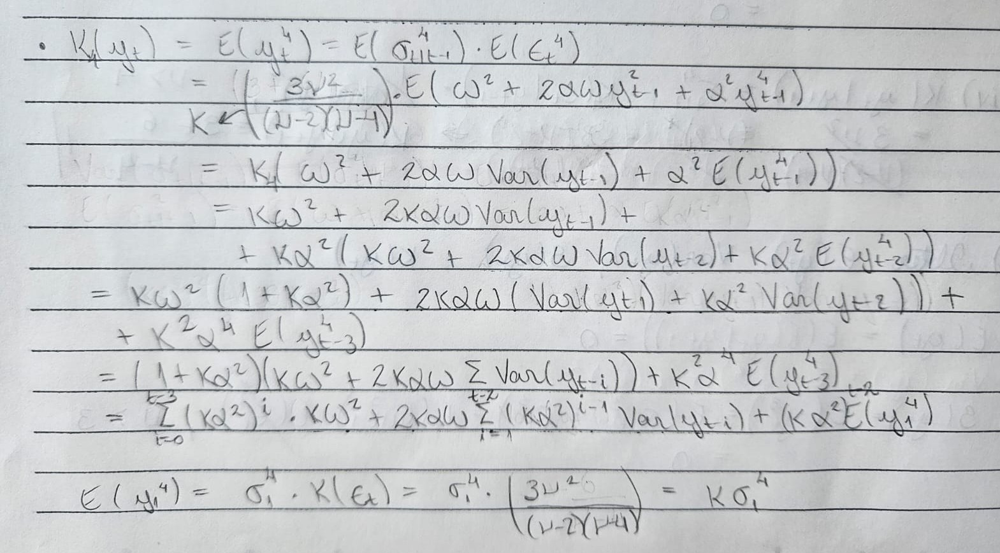
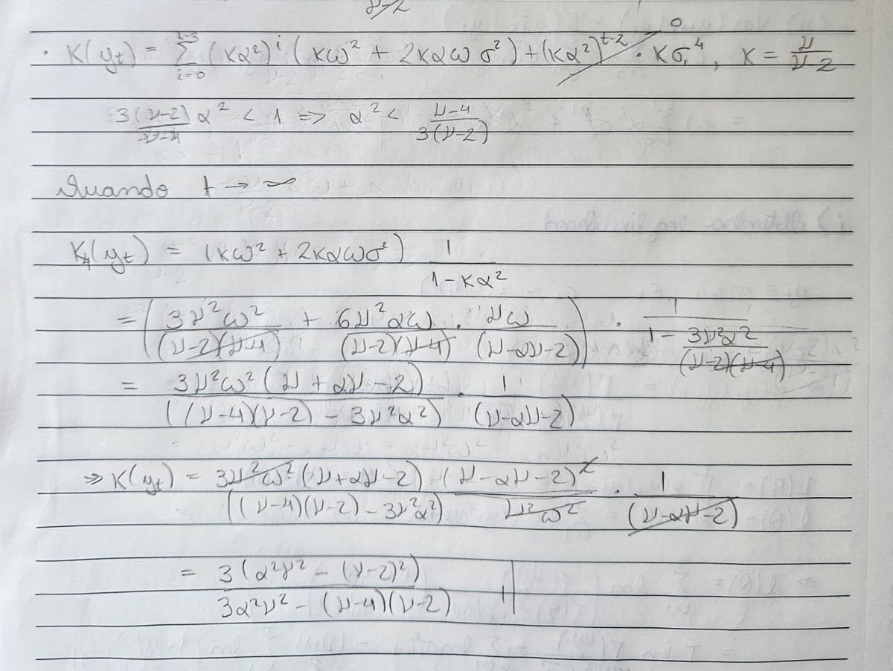

## Item d) Distribuição incondicional [TODO]

## Item e) Correlações
### i) Linear
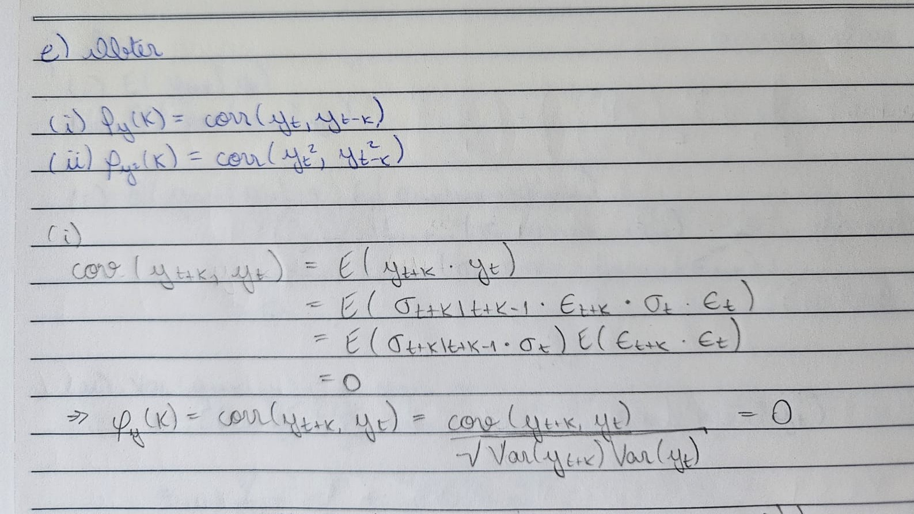

### ii) Quadrática
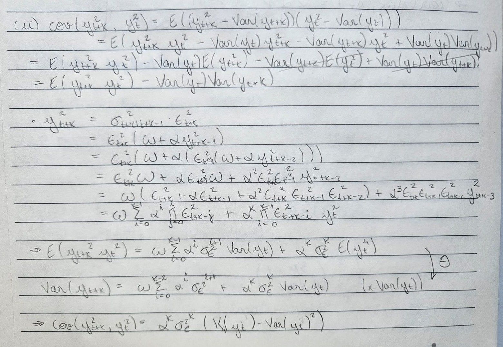
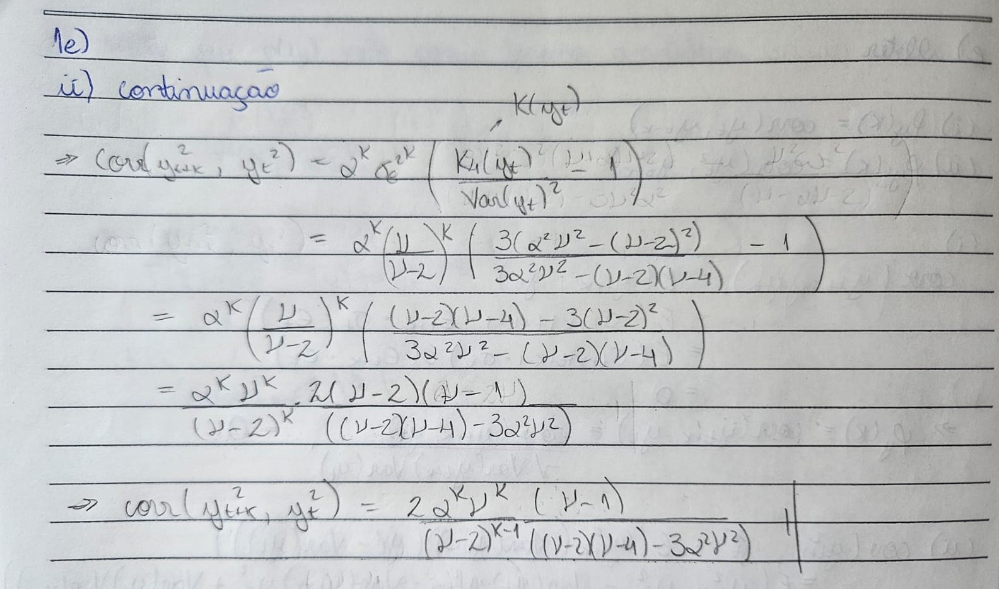

## Item f) Momentos da distribuição preditiva

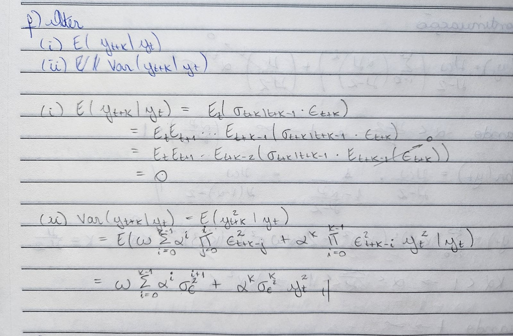

## Item g) Distribuição preditiva [TODO]

## Item h) Simulação
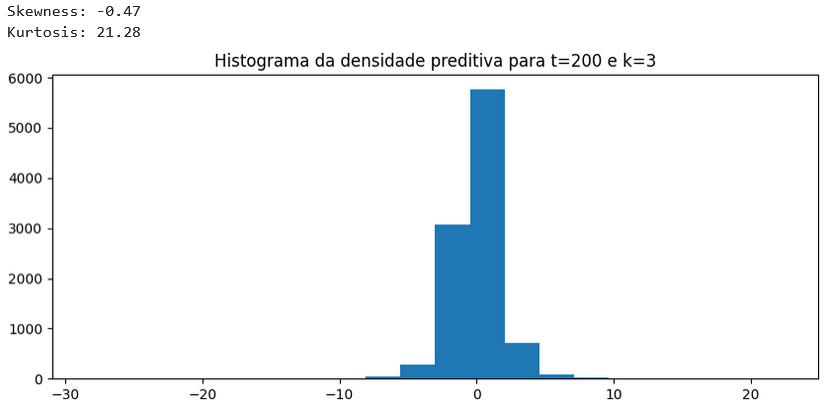
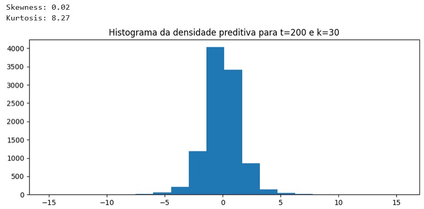


```bash
import numpy as np
import matplotlib.pyplot as plt
from matplotlib.ticker import PercentFormatter
import scipy.stats as stats
import seaborn as sns
from statsmodels.graphics.tsaplots import plot_acf, plot_pacf
import yfinance as yf
from arch import arch_model
import pandas as pd

rng = np.random.default_rng(seed=4)

# simulação da série do modelo
ν = 5
ω, α = 1, 0.2
T = 200
y1 = 5

ϵt = rng.standard_t(df=ν, size=T)
yt = np.zeros(T)
yt[0] = y1

for i in range(1, T):
    σ2 = ω + α * yt[i-1]**2
    yt[i] = σ2**0.5 * ϵt[i]

series = yt.copy()

# simulação da densidade preditiva
k = 3
N = 10000

y_hat = np.zeros((T+k,N))

for t in range(T):
    y_curr = np.full(N, series[t])
    ϵt = rng.standard_t(df=ν, size=(k,N))
    
    for i in range(k):
        σ2_hat = ω + α * y_curr**2
        y_curr = σ2_hat**0.5 * ϵt[i]

    y_hat[t+k] = y_curr

# histograma
print(f'Skewness: {stats.skew(y_hat[T-1+k]):.2f}')
print(f'Kurtosis: {stats.kurtosis(y_hat[T-1+k]) + 3:.2f}')

fig, ax = plt.subplots(figsize=(10,4))
ax.hist(y_hat[T-1+k], bins=20)
ax.set_title('Histograma da densidade preditiva para t=200 e k=3')
plt.show()
```

## Item i) Log verossimilhança
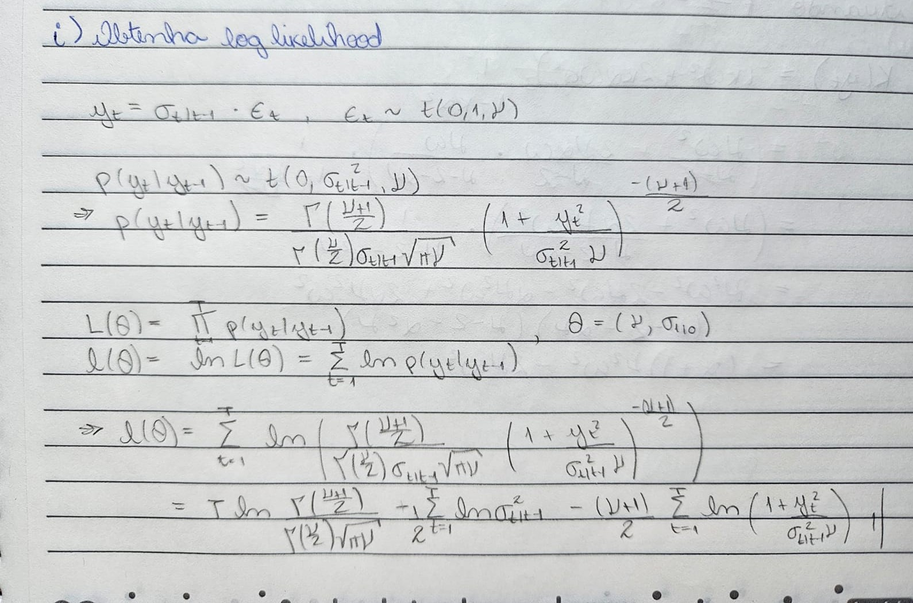


## Item j) Retornos diários


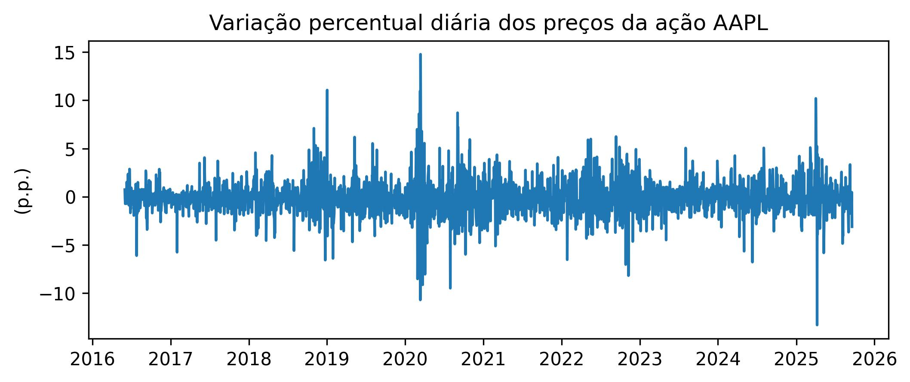
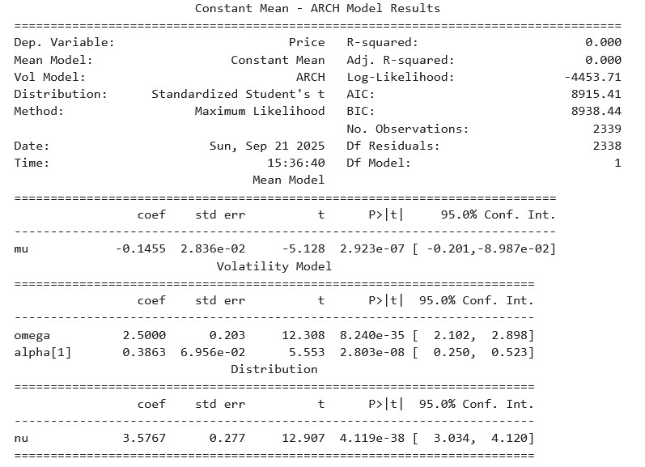
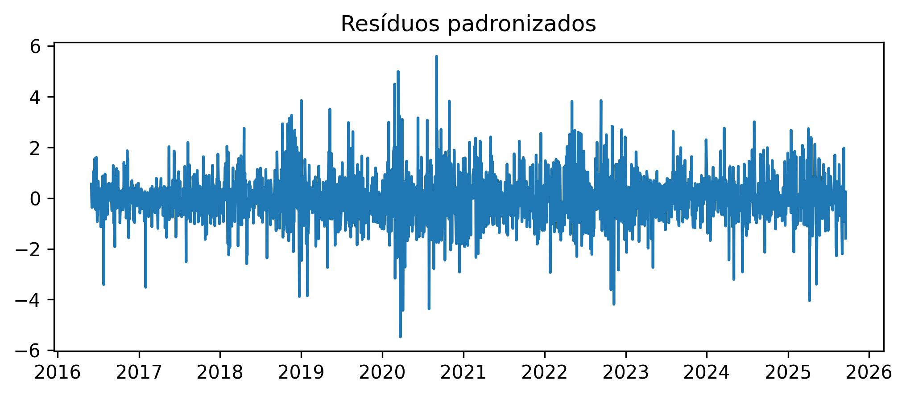
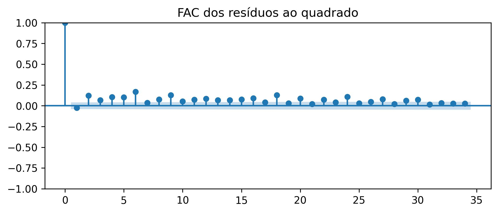


```bash
import numpy as np
import matplotlib.pyplot as plt
from matplotlib.ticker import PercentFormatter
import scipy.stats as stats
import seaborn as sns
from statsmodels.graphics.tsaplots import plot_acf, plot_pacf
import yfinance as yf
from arch import arch_model
import pandas as pd

# importação de dados
series = pd.read_csv('C:\\Users\\aless\\Downloads\\Apple Stock Price History.csv')[['Date','Price']].set_index('Date')
series.index = pd.to_datetime(series.index)

returns = series.pct_change().mul(100).dropna().loc['2016-06':]

# estimação do modelo
model = arch_model(returns, vol='GARCH', p=1, q=0, dist='t', mean='Constant')
res = model.fit(disp='off')
print(res.summary())

std_resid = res.std_resid.dropna()

# figuras
fig, ax = plt.subplots(figsize=(8,3))
ax.plot(returns)
ax.set_title('Variação percentual diária dos preços da ação AAPL')
ax.set_ylabel('(p.p.)')
plt.savefig('C:\\Users\\aless\\Desktop\\Codes\\masters\\SDM\\img\\retornos.jpg', dpi=300, bbox_inches='tight')
plt.show()

fig, ax = plt.subplots(figsize=(8,3))
ax.plot(std_resid)
ax.set_title('Resíduos padronizados')
plt.savefig('C:\\Users\\aless\\Desktop\\Codes\\masters\\SDM\\img\\resíduos.jpg', dpi=300, bbox_inches='tight')
plt.show()

fig, ax = plt.subplots(figsize=(8,3))
plot_acf(std_resid**2, ax=ax, title='FAC dos resíduos ao quadrado')
plt.savefig('C:\\Users\\aless\\Desktop\\Codes\\masters\\SDM\\img\\FAC.jpg', dpi=300, bbox_inches='tight')
plt.show()

```

# Questão 2
## item a) $  y_t = g_{t|t-1} + \epsilon_t$ 
### i) $ \epsilon_t \sim  Gamma(\mu,\theta)$
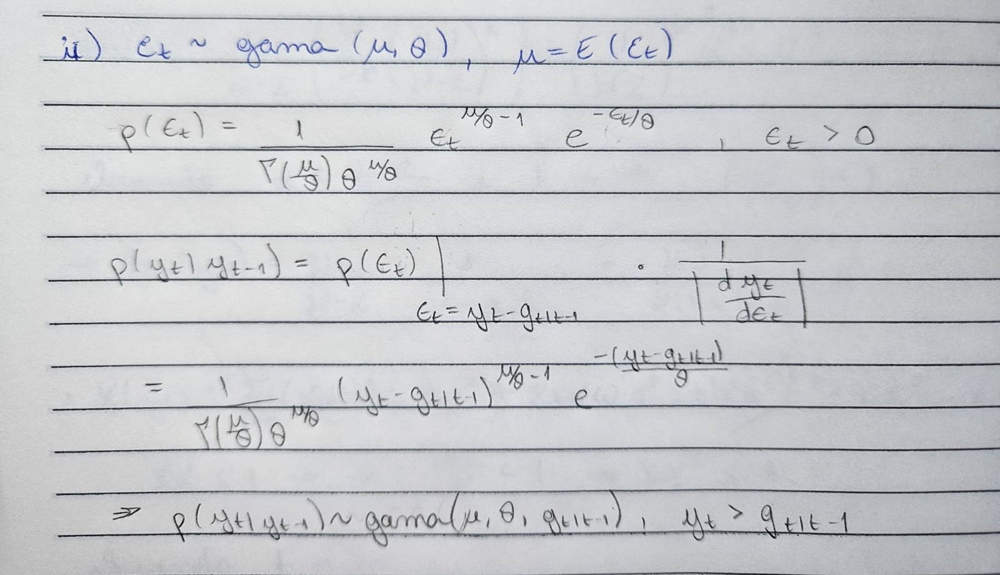

### ii) $ \epsilon_t \sim  Poisson(\lambda)$
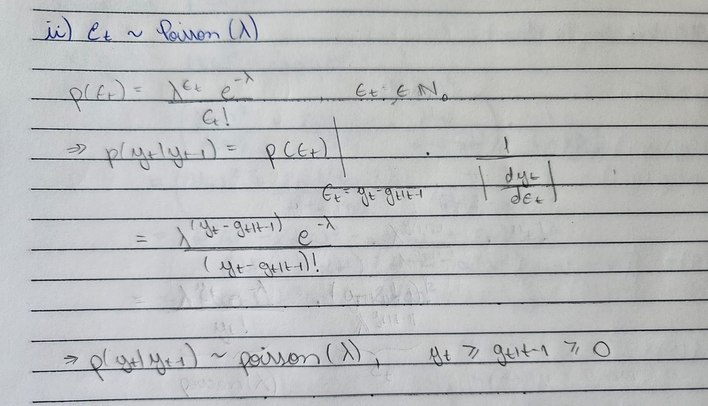

### iii) $ \epsilon_t \sim  Beta(\alpha, \beta)$
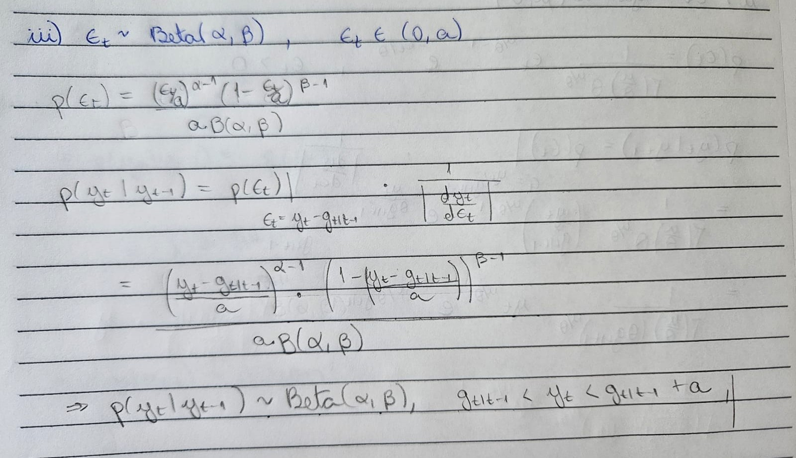

## item b) $  y_t = g_{t|t-1} \cdot \epsilon_t$ 
### i) $ \epsilon_t \sim  Exp(\lambda)$

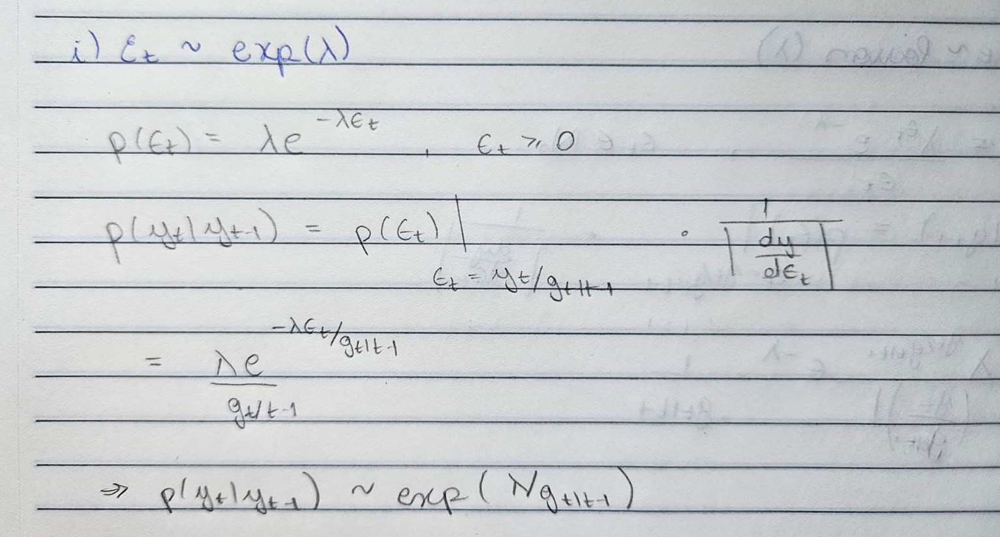

### ii) $ \epsilon_t \sim  Gamma(\mu, \theta)$
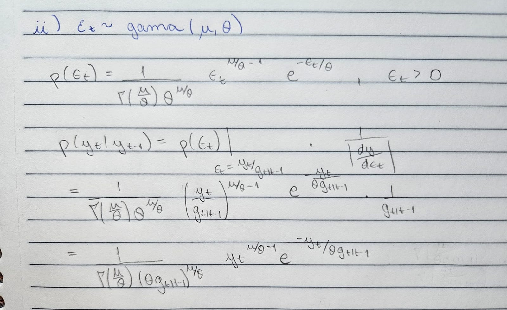

### iii) $ \epsilon_t \sim  Poisson(\lambda)$
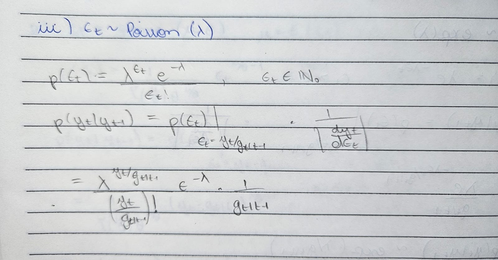